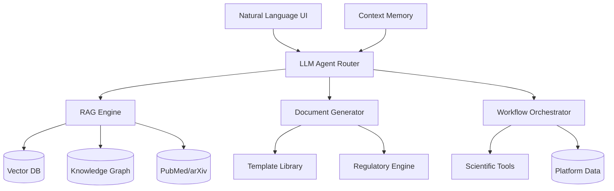

# Genskey AI Pillar 2: LLM Co-Scientist System
## Intelligent Research Assistant & Knowledge Platform

**Version**: 3.0-AI-Copilot  
**Date**: 2025-12-11  
**Focus**: Single & Multi-Agent LLM for Scientific Research Assistance

---

## 🎯 Vision & Strategic Goals

### Core Objective
Build an **AI-powered Co-Scientist** platform that augments human researchers with:
- Real-time literature mining & synthesis
- Automated document generation (reports, protocols, compliance docs)
- Hypothesis generation & experimental design
- Regulatory document intelligence
- Natural language interface for complex scientific workflows

### Key Differentiators
1. **Domain-Specific RAG**: Trained on LBP/microbiome research corpus
2. **Multi-Modal Output**: Generate PDFs, presentations, regulatory submissions
3. **Scientific Reasoning**: Chain-of-thought for hypothesis validation
4. **Contextual Memory**: Persistent project context across sessions
5. **Knowledge Graph Integration**: Connect research insights to platform data

---

## 🏗️ System Architecture

### High-Level Components



---

## 📚 Component 1: RAG System (Research Intelligence)

### Data Sources

#### Primary Sources
1. **PubMed/PubMed Central**
   - API integration for real-time search
   - Focus: Microbiome, LBP, clinical trials
   - Update frequency: Daily

2. **arXiv/bioRxiv**
   - Pre-print servers for latest research
   - Categories: q-bio, cs.LG (for ML papers)

3. **User-Uploaded Documents**
   - Internal research reports
   - Competitor analysis
   - Regulatory guidelines
   - Lab protocols

4. **Proprietary Knowledge Base**
   - Strain library metadata
   - Experimental results
   - Clinical trial data
   - Manufacturing SOPs

#### Vector Database Architecture
```python
# Tech Stack
Vector DB: Pinecone / Weaviate / Milvus
Embedding Model: 
  - General: text-embedding-3-large (OpenAI)
  - Scientific: BiomedBERT / PubMedBERT
  - Hybrid: Ensemble voting

# Index Structure
{
  "document_id": "PMC12345678",
  "title": "...",
  "abstract_embedding": [768-dim vector],
  "full_text_chunks": [
    {"chunk_id": 1, "text": "...", "embedding": [...], "metadata": {...}}
  ],
  "metadata": {
    "source": "PubMed",
    "publication_date": "2024-01-15",
    "journal": "Nature Medicine",
    "doi": "10.1038/...",
    "keywords": ["microbiome", "IBD", "F. prausnitzii"],
    "citation_count": 42,
    "impact_factor": 58.7
  }
}
```

#### Knowledge Graph Schema
```cypher
// Neo4j Graph Schema
(:Paper {pmid, title, abstract, year})
(:Strain {id, species, genome_id})
(:Disease {name, icode, description})
(:Gene {name, function, pathway})
(:Clinical_Trial {nct_id, phase, status})
(:Company {name, pipeline})

// Relationships
(Paper)-[:STUDIES]->(Strain)
(Paper)-[:INVESTIGATES]->(Disease)
(Strain)-[:TREATS]->(Disease)
(Strain)-[:CONTAINS_GENE]->(Gene)
(Clinical_Trial)-[:TESTS]->(Strain)
(Company)-[:DEVELOPS]->(Strain)
```

### RAG Query Pipeline

#### Hybrid Retrieval Strategy
```python
def hybrid_rag_search(query: str, filters: dict):
    """
    Multi-stage retrieval combining:
    1. Semantic search (vector similarity)
    2. Lexical search (BM25)
    3. Graph traversal (knowledge graph)
    4. Re-ranking (cross-encoder)
    """
    
    # Stage 1: Dense retrieval
    query_embedding = embed_model.encode(query)
    semantic_results = vector_db.similarity_search(
        query_embedding, 
        top_k=50,
        filters=filters  # e.g., {year: >=2020, journal_if: >=10}
    )
    
    # Stage 2: Sparse retrieval (keyword matching)
    lexical_results = bm25_index.search(query, top_k=50)
    
    # Stage 3: Knowledge graph enhancement
    kg_entities = extract_entities(query)  # ["F. prausnitzii", "IBD"]
    kg_results = neo4j.traverse(
        start_nodes=kg_entities,
        max_hops=2,
        relationship_types=["TREATS", "STUDIES"]
    )
    
    # Stage 4: Fusion & Re-ranking
    combined = reciprocal_rank_fusion([semantic_results, lexical_results, kg_results])
    reranked = cross_encoder.rerank(query, combined, top_k=10)
    
    return reranked
```

#### Context-Aware Retrieval
```python
class ContextManager:
    """
    Maintains conversation context and project memory
    """
    def __init__(self, user_id, project_id):
        self.conversation_history = []
        self.project_context = load_project_context(project_id)
        self.user_preferences = load_user_profile(user_id)
    
    def enhance_query(self, query):
        # Add project context
        enhanced = f"""
        Project: {self.project_context.name}
        Disease Target: {self.project_context.disease}
        Relevant Strains: {self.project_context.candidates}
        
        User Query: {query}
        
        Previous Context: {self.get_recent_context(n=3)}
        """
        return enhanced
```

---

## 🤖 Component 2: Co-Scientist Agent System

### Agent Capabilities

#### 1. Literature Analysis Agent
**Function**: Mine, synthesize, and summarize research papers

**Capabilities**:
- **Smart Search**: "Find recent papers on F. prausnitzii for IBD treatment"
- **Synthesis**: "Summarize mechanisms of action across 10 papers"
- **Gap Analysis**: "What hasn't been studied about A. muciniphila safety?"
- **Citation Mapping**: Visualize citation networks

**Prompt Template**:
```python
LITERATURE_AGENT_PROMPT = """
You are a scientific literature analyst specializing in microbiome and LBP research.

Task: {task_type}  # retrieve / summarize / compare / gap_analysis

Context:
- User Project: {project_name} targeting {disease}
- Relevant Strains: {strain_list}
- Previous Findings: {context}

Retrieved Papers: {rag_results}

Instructions:
1. Analyze the papers for {specific_aspect}
2. Identify key findings, methodologies, and outcomes
3. Note any conflicting results or gaps
4. Provide actionable insights for the user's project
5. Cite sources with [PMID: xxx] format

Output Format: {output_format}  # bullet_points / table / narrative
"""
```

#### 2. Experimental Design Agent
**Function**: Suggest experimental protocols and designs

**Capabilities**:
- **Protocol Generation**: "Design an in vitro SCFA production assay for 3 strains"
- **Sample Size Calculation**: "How many patients for Phase II trial with 80% power?"
- **Control Recommendations**: "What controls should I include?"
- **Timeline Estimation**: "Estimate timeline for strain characterization"

**Integration with Platform**:
```python
# Pull data from platform
available_strains = query_strain_library(filters={...})
equipment = query_equipment_availability()
budget = get_project_budget()

# Generate optimized protocol
protocol = experimental_design_agent.generate(
    objective="Characterize butyrate production",
    strains=available_strains[:5],
    constraints={
        "equipment": equipment,
        "budget": budget,
        "timeline": "3 months"
    }
)
```

#### 3. Regulatory Document Agent
**Function**: Generate and review compliance documents

**Capabilities**:
- **IND Preparation**: "Generate CMC section for F. prausnitzii IND"
- **Guideline Mapping**: "Compare our protocol to FDA LBP guidance"
- **Gap Checklist**: "What's missing from our safety dossier?"
- **Version Tracking**: Track regulatory document changes

**Regulatory Knowledge Base**:
```json
{
  "guidelines": [
    {
      "id": "FDA_LBP_2016",
      "title": "FDA Guidance for Industry: Early Clinical Trials with Live Biotherapeutic Products",
      "sections": ["Chemistry, Manufacturing and Controls", "Preclinical Safety", "Clinical Protocol"],
      "requirements": {...},
      "embeddings": [...]
    },
    {
      "id": "NMPA_2021",
      "title": "中国NMPA微生态活菌制剂技术指导原则",
      "sections": [...],
      "requirements_chinese": {...}
    }
  ]
}
```

#### 4. Hypothesis Generation Agent
**Function**: Scientific chain-of-thought reasoning

**Capabilities**:
- **Mechanism Prediction**: "Why might A. muciniphila improve glucose homeostasis?"
- **Synergy Hypothesis**: "Which strains might work synergistically?"
- **Failure Analysis**: "Why did our Phase I trial show variable response?"
- **Next Steps**: "What experiments would validate this hypothesis?"

**Chain-of-Thought Prompting**:
```python
COT_PROMPT = """
Given the following observations:
{observations}

Think step-by-step to generate a testable hypothesis:

Step 1: Identify patterns and correlations
Step 2: Consider known biological mechanisms
Step 3: Propose a causal pathway
Step 4: Predict outcomes if hypothesis is true
Step 5: Suggest experiments to test hypothesis

Provide reasoning at each step, citing relevant literature.
"""
```

#### 5. Data Insight Agent
**Function**: Analyze platform data and generate insights

**Capabilities**:
- **Pattern Detection**: "Analyze batch quality trends over 6 months"
- **Anomaly Alerts**: "Flag unusual strain behavior in fermentation"
- **Correlation Analysis**: "Do clinical responders share microbiome signatures?"
- **Predictive Modeling**: "Forecast next quarter's production yield"

**Integration Example**:
```python
# Query platform database
batch_data = query_batches(date_range="2024-01-01 to 2024-12-11")
clinical_data = query_clinical_outcomes(trial_id="TRIAL-001")

# Agent analysis
insights = data_insight_agent.analyze(
    data={"batches": batch_data, "clinical": clinical_data},
    question="Are there manufacturing parameters that correlate with clinical efficacy?"
)
```

---

## 📝 Component 3: Document Generation System

### Document Templates

#### 1. Research Report
```markdown
# {Project Name} - Research Report

## Executive Summary
{AI-generated summary of key findings}

## Objectives
- {objective_1}
- {objective_2}

## Methods
{AI-generated from experimental design}

## Results
### Strain Characterization
{Auto-populated from StrainLibrary data}

### In Vitro Assays
{Charts from AnalyticsWorkbench}

## Discussion
{AI synthesis of results + literature}

## Conclusions
{AI-generated based on results}

## References
{Auto-citation of papers from RAG}
```

#### 2. IND/CTA Application
```
SECTIONS (Auto-generated):
1. Cover Letter
2. Form FDA 1571
3. CMC (Chemistry, Manufacturing, and Controls)
   - Manufacturing Process (from ProductionSchedule)
   - Quality Control (from QC data)
   - Stability Data
4. Preclinical Safety
   - Animal Studies (from AnimalStudies page)
   - Genomic Safety Analysis
5. Clinical Protocol
   - Trial Design (from TrialDesign)
   - Inclusion/Exclusion Criteria
6. Investigator's Brochure
```

#### 3. Protocol SOP
```markdown
# Standard Operating Procedure: {Title}

Document ID: {Auto-assigned}
Version: {Version tracking}
Effective Date: {Auto-filled}

## Purpose
{AI-generated from user brief}

## Scope
{Auto-determined}

## Responsibilities
{Role-based from TeamPerformance}

## Materials and Equipment
{Linked to EquipmentManager inventory}

## Procedure
{Step-by-step AI-generated with safety checks}

## Quality Control
{Auto-linked to QC requirements}

## Revision History
{Git-style version control}
```

### Multi-Format Export

```python
class DocumentGenerator:
    def generate(self, template_type, data, format="pdf"):
        """
        Generates documents in multiple formats
        """
        # Populate template
        content = self.fill_template(template_type, data)
        
        # Convert to requested format
        if format == "pdf":
            return self.to_pdf(content, style="regulatory")
        elif format == "docx":
            return self.to_docx(content)
        elif format == "html":
            return self.to_html(content, interactive=True)
        elif format == "markdown":
            return content
        
    def to_pdf(self, content, style="regulatory"):
        # Use WeasyPrint or ReportLab
        # Regulatory style: formal fonts, headers, page numbers
        # Research style: figures, tables, citations
        pass
```

---

## 🎨 Component 4: Natural Language UI/UX

### Conversational Interface Design

#### Chat-Based Workflow
```jsx
// AI Chat Component
<AICopilotChat>
  <MessageThread>
    <UserMessage>
      "Design a stability study for our F. prausnitzii formulation"
    </UserMessage>
    
    <AgentMessage agent="ExperimentalDesign">
      I'll help design a comprehensive stability study. Let me gather some information:
      
      1. Retrieved your formulation: FORM-001 (microencapsulated, freeze-dried)
      2. Regulatory requirement: ICH Q1A (12 months, multiple temperatures)
      3. Your current budget: $50K allocated for stability
      
      Recommended Protocol:
      - Conditions: 4°C, 25°C/60%RH, 40°C/75%RH
      - Timepoints: 0, 1, 3, 6, 9, 12 months
      - Tests: Viability (CFU), moisture content, genetic stability (WGS)
      - Sample size: 3 batches × 3 conditions × 6 timepoints = 54 samples
      
      [Generate Full Protocol] [Modify Parameters] [Export SOP]
    </AgentMessage>
    
    <SystemCard type="action">
      Protocol SOP-STB-001 created and added to Protocol Library
      Equipment reservation flagged for thermostatic chambers
    </SystemCard>
  </MessageThread>
  
  <QuickActions>
    <ActionButton>Literature Search</ActionButton>
    <ActionButton>Generate Document</ActionButton>
    <ActionButton>Analyze Data</ActionButton>
    <ActionButton>Create Workflow</ActionButton>
  </QuickActions>
</AICopilotChat>
```

#### Intent Recognition & Routing
```python
class IntentRouter:
    """
    Natural language understanding to route queries to appropriate agents
    """
    intents = {
        "literature_search": LiteratureAgent,
        "experimental_design": ExperimentalDesignAgent,
        "data_analysis": DataInsightAgent,
        "document_generation": DocumentAgent,
        "hypothesis": HypothesisAgent,
        "regulatory": RegulatoryAgent
    }
    
    def route(self, user_message, context):
        # Use LLM for intent classification
        intent = self.classify_intent(user_message)
        
        # Route to appropriate agent
        agent = self.intents[intent]
        return agent.respond(user_message, context)
    
    def classify_intent(self, message):
        # Zero-shot classification with LLM
        prompt = f"""
        Classify the user intent:\n\n"{message}"\n\n
        Intent categories:
        - literature_search: finding papers, research summaries
        - experimental_design: protocol design, methodology questions
        - data_analysis: analyzing results, finding patterns
        - document_generation: creating reports, SOPs, regulatory docs
        - hypothesis: scientific reasoning, mechanism questions
        - regulatory: compliance, guidelines, IND/CTA preparation
        
        Intent:
        """
        return llm.complete(prompt).strip().lower()
```

### Voice Interface (Optional Enhancement)
```python
# Speech-to-text for hands-free lab environment
voice_input = speech_to_text(audio_stream)
response = agent.respond(voice_input)
text_to_speech(response, voice="professional_female")
```

---

## 🧠 Component 5: Memory & Personalization

### Context Persistence

#### Session Memory
```python
class SessionMemory:
    """
    Short-term memory for current conversation
    """
    def __init__(self):
        self.messages = []
        self.entities = {}  # Mentioned strains, papers, projects
        self.tasks = []     # Pending actions
    
    def add_message(self, role, content):
        self.messages.append({"role": role, "content": content})
        self.extract_entities(content)
    
    def get_context_window(self, max_tokens=8000):
        # Return recent messages that fit in context
        return self.messages[-10:]  # Keep last 10 exchanges
```

#### Long-Term Memory (Projects)
```python
class ProjectMemory:
    """
    Persistent project context across sessions
    """
    structure = {
        "project_id": "PROJ-001",
        "name": "F. prausnitzii IBD Program",
        "disease_target": "UC",
        "lead_strains": ["CAND-042", "CAND-087"],
        "timeline": {...},
        "key_findings": [
            {"date": "2024-12-01", "finding": "Batch QC passed with 95% viability"},
            {"date": "2024-12-05", "finding": "Lit review shows 78% efficacy in similar trials"}
        ],
        "pending_questions": [
            "Optimal dosage for Phase II",
            "Biomarker selection for patient stratification"
        ],
        "documents": [
            {"type": "IND_draft", "version": 2, "status": "in_review"},
            {"type": "protocol", "id": "SOP-001", "status": "approved"}
        ]
    }
```

#### User Preferences
```python
user_profile = {
    "user_id": "researcher_001",
    "role": "R&D Scientist",
    "expertise": ["microbiome", "fermentation"],
    "preferred_detail_level": "technical",  # vs "executive_summary"
    "preferred_output_format": "markdown",
    "citation_style": "Vancouver",
    "language": "zh-CN",
    "frequent_tasks": ["literature_search", "protocol_design"]
}
```

---

## 🔧 Technical Implementation Stack

### Backend
```python
# LLM & Embeddings
LLM: OpenAI GPT-4 / Anthropic Claude 3 Opus / Local LLaMA 3
Embeddings: text-embedding-3-large + PubMedBERT ensemble
Fine-tuning: LoRA adapters for domain-specific tasks

# Vector Database
Primary: Pinecone (managed, scalable)
Alternative: Weaviate (open-source, hybrid search)

# Knowledge Graph
Neo4j: Biomedical knowledge graph
Graph algorithms: PageRank for paper importance, Community detection

# Document Processing
PDF parsing: PyMuPDF, pdfplumber
OCR: Tesseract for scanned documents
Table extraction: Camelot

# Document Generation
PDF: WeasyPrint, ReportLab
DOCX: python-docx
LaTeX: For scientific publications

# Search & Retrieval
Elasticsearch: Full-text search
BM25: Lexical matching
Cross-encoder: ms-marco-MiniLM for re-ranking

# APIs
PubMed E-utilities: https://eutils.ncbi.nlm.nih.gov/
ArXiv API: http://export.arxiv.org/api/query
Semantic Scholar: https://api.semanticscholar.org/
```

### Frontend
```javascript
// AI Chat Interface
React + TypeScript
Component Library: Ant Design / Material-UI
Markdown Rendering: react-markdown with syntax highlighting
Latex Rendering: KaTeX for mathematical expressions

// Real-time Updates
WebSocket for streaming LLM responses
Server-Sent Events (SSE) for long-running tasks

// Document Preview
PDF.js for inline preview
Monaco Editor for code/protocol editing
```

---

## 📊 User Journeys & Use Cases

### Use Case 1: Literature-Driven Hypothesis
**Researcher**: "I want to understand why F. prausnitzii helps IBD patients"

**AI Workflow**:
1. RAG searches 50 recent papers
2. Synthesizes mechanisms: SCFA production, Treg stimulation, epithelial barrier repair
3. Generates hypothesis: "F. prausnitzii-derived butyrate upregulates tight junction proteins"
4. Suggests validation experiments: Caco-2 assay, RNA-seq, TEER measurement
5. Pulls existing in-vitro data from platform to compare

### Use Case 2: IND Preparation Sprint
**Regulatory Affairs**: "Prepare CMC section for IND submission in 2 weeks"

**AI Workflow**:
1. Pulls manufacturing data from ProductionSchedule, QualityControl
2. Retrieves relevant SOP documents from ProtocolLibrary
3. Analyzes batch records for consistency
4. Generates draft CMC section following FDA format
5. Inserts tables, figures, batch analytics automatically
6. Flags missing data: "Stability study at 40°C only has 3-month data"
7. Human reviews and approves

### Use Case 3: Weekly Research Digest
**Team Lead**: "Summarize this week's microbiome research relevant to our projects"

**AI Workflow**:
1. Monitors PubMed RSS feeds for keywords: IBD, microbiome, LBP
2. Filters to high-impact journals (IF > 10)
3. Summarizes each paper in 2-3 bullet points
4. Tags papers by relevance to active projects
5. Generates email digest with clickable links
6. Stores summaries in project knowledge base

### Use Case 4: Protocol Troubleshooting
**Lab Scientist**: "Our freeze-drying survival rate dropped from 90% to 65%. Why?"

**AI Workflow**:
1. Queries recent batch data from EquipmentManager, ProductionSchedule
2. Identifies parameter changes: lyophilization temperature increased by 2°C
3. Searches literature: "temperature sensitivity of F. prausnitzii freeze-drying"
4. Suggests: "Studies show optimal lyophilization at -40°C for Firmicutes"
5. Recommends: reverting temperature and testing cryoprotectant concentration

---

## 🚀 Implementation Roadmap

### Phase 1: RAG Foundation (Weeks 1-3)
- [ ] Set up Pinecone vector database
- [ ] Integrate PubMed API + embedding pipeline
- [ ] Build basic RAG query system
- [ ] Create knowledge graph schema in Neo4j
- [ ] Upload seed data: 1000 microbiome papers

### Phase 2: Core Agents (Weeks 4-6)
- [ ] Literature Analysis Agent
- [ ] Experimental Design Agent
- [ ] Basic document templates
- [ ] Chat interface MVP
- [ ] Session memory implementation

### Phase 3: Document Generation (Weeks 7-9)
- [ ] Regulatory Document Agent
- [ ] Protocol SOP templates
- [ ] Multi-format export (PDF, DOCX)
- [ ] Template library UI
- [ ] Version control for documents

### Phase 4: Advanced Features (Weeks 10-12)
- [ ] Hypothesis Generation Agent
- [ ] Data Insight Agent (platform integration)
- [ ] Project memory & personalization
- [ ] Knowledge graph visualization
- [ ] Advanced RAG (hybrid retrieval)

### Phase 5: Production Polish (Weeks 13-16)
- [ ] Performance optimization
- [ ] Cost management (LLM API usage)
- [ ] Security & access control
- [ ] User training & documentation
- [ ] A/B testing of prompts

---

## 💰 Cost Estimation

### Infrastructure Costs (Monthly)
- **Vector DB** (Pinecone): ~$70/month (100K vectors, 1 pod)
- **LLM API** (OpenAI GPT-4): $0.03/1K tokens → ~$500-2000/month (depending on usage)
- **Neo4j** (AuraDB): ~$65/month (small instance)
- **Compute** (AWS/GCP): ~$200/month (backend services)

**Total**: ~$835-2335/month

### Cost Optimization Strategies
1. **Prompt caching**: Cache common queries
2. **Fine-tuned smaller models**: GPT-3.5-turbo for simple tasks
3. **Open-source LLMs**: LLaMA 3 8B for RAG retrieval
4. **User quotas**: Limit queries per user to control costs

---

## 📈 Success Metrics

### Quantitative KPIs
- **RAG Precision@10**: ≥ 80% (relevant papers in top 10)
- **Response Time**: < 5s for simple queries, < 30s for complex
- **Document Quality**: > 85% human approval rate
- **User Engagement**: > 50 queries/user/month
- **Time Savings**: Reduce literature review time by 60%

### Qualitative KPIs
- User satisfaction (NPS score)
- Reduction in protocol iteration cycles
- Faster IND preparation (weeks → days)
- Improved hypothesis hit rate

---

## 🔒 Security & Compliance

### Data Privacy
- User conversations: Encrypted at rest (AES-256)
- PII redaction: Automatic removal before LLM processing
- Audit logs: All AI interactions logged for compliance

### IP Protection
- Proprietary knowledge: Siloed from public RAG corpus
- Document watermarking: Generated docs marked with user/timestamp
- Access control: Role-based permissions (RBAC)

---

## 🎓 Training & Onboarding

### User Training Plan
1. **Quickstart Guide**: 15-min video tutorial
2. **Prompt Engineering**: Best practices for scientific queries
3. **Document Templates**: How to customize and use
4. **Weekly Tips**: Email newsletter with use cases

### Prompt Examples Library
```
Good Prompts:
✅ "Find 2024 papers on A. muciniphila metabolic syndrome trials with > 50 patients"
✅ "Design a stability protocol for freeze-dried LBP following ICH Q1A"
✅ "Generate hypothesis for why Strain GNS0042 showed higher efficacy in female patients"

Poor Prompts:
❌ "Tell me about probiotics" (too broad)
❌ "Help" (unclear intent)
❌ "Find papers" (missing context)
```

---

## 🔮 Future Enhancements (V4.0+)

1. **Multi-modal RAG**: Image analysis from papers (charts, microscopy)
2. **Active Learning**: Agent asks clarifying questions
3. **Collaborative Agents**: Multiple agents debate hypotheses
4. **Predictive Alerts**: "Your trial design may need FDA pre-IND meeting"
5. **Integration with Lab Automation**: Generate protocols executable by robots
6. **Scientific Writing Assistant**: Co-author papers with tracked contributions

---

## ✅ Decision Points for User

### Critical Choices
1. **LLM Provider**: OpenAI GPT-4 ($$) vs Open-source LLaMA 3 ($)
   - **Recommendation**: Start with GPT-4, migrate to hybrid after validation

2. **Vector DB**: Managed (Pinecone) vs Self-hosted (Weaviate)
   - **Recommendation**: Pinecone for faster deployment, Weaviate for cost control long-term

3. **Document Formats**: Focus on PDF/DOCX or expand to LaTeX/HTML?
   - **Recommendation**: Start with PDF/DOCX (regulatory priority)

4. **Language Support**: English-only vs Bilingual (Chinese + English)
   - **Recommendation**: Bilingual from start (critical for NMPA submissions)

### Next Steps
1. **Approve architecture** & prioritize phases
2. **Allocate budget** (~$3K/month infrastructure + development)
3. **Define pilot use cases** (suggest: IND preparation + literature digest)
4. **Kickoff Phase 1** (RAG foundation)

**Ready to proceed upon your approval! 🚀**
